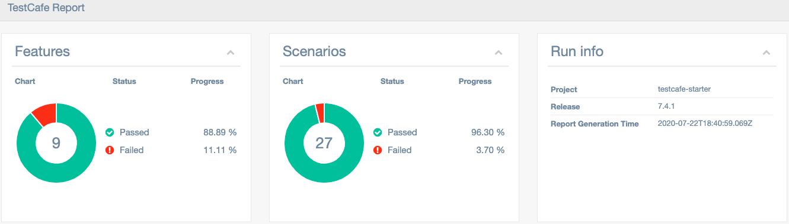

# JSON TestCafé Reporter [](https://www.npmjs.com/package/testcafe-reporter-cucumber-json)

This is the **JSON** reporter plugin for [TestCafé](http://devexpress.github.io/testcafe).

This TestCafé reporter generates JSON files that can be merged and converted to a nice and searchable html report by using [multiple-cucumber-html-reporter](https://github.com/wswebcreation/multiple-cucumber-html-reporter).

JSON files generated by this reporter have the same schema than those generated by the Cucumber JSON reporter: this is why `fixture` is translated to `Feature` and `test` to `Scenario` in the final HTML report.




## To install this TestCafé Reporter

- run the command:

  ```sh
  npm install --save testcafe-reporter-cucumber-json
  ```

## Usage

- add to the TestCafé command-line the following options:

  ```sh
  testcafe chrome ./path-to-tests/*(.js|.testcafe|.ts) --reporter cucumber-json
  ```

JSON files will be automatically created in a folder named `cucumber-json-reports` at the root of your project.

If you need to change this folder, add this option on the TestCafé command-line:

```sh
--reporter-json-folder='my-custom-folder'
```

or add/edit the `args` section inside the `testcafe-reporter-cucumber-json.json` configuration file:

```json
  "args": {
    "reportFolder": "my-custom-folder"
  }
```

or set the environment variable `--reporter-json-folder` (in this case this variable will take precedence over the command-line option and the configuration file):

```js
process.env['--reporter-json-folder'] = 'my-custom-folder';
```

At each TestCafé run, this reporter will create a separate JSON file for each browser started by TestCafé.

Each JSON file will be named : `[browser name][browser platform][date and time of execution].json`.

Examples:

```sh
  cucumber-json-reports
  |- Chrome_83_0_4103_116_macOS_10_15_5-2020-07-04T19-44-58-493Z.json
  |- Firefox_78_0_macOS_10_15-2020-07-04T19-44-58-493Z.json
  |- Microsoft_Edge_83_0_478_58_macOS_10_15_5-2020-07-04T19-38-05-688Z.json
  |- Microsoft_Edge_83_0_478_58_macOS_10_15_5-2020-07-04T19-44-58-493Z.json
  |- Safari_13_1_1_macOS_10_15_5-2020-07-04T19-44-58-493Z.json
  |- ...
```

If you would like to show in the report the App name targeted by your tests, add this option on the TestCafé command-line:

```sh
--reporter-app-name='My App'
```

or add/edit the `args` section inside the `testcafe-reporter-cucumber-json.json` configuration file:

```json
  "args": {
    "appName": "My App",
  }
```

or set the environment variable `--reporter-app-name` (in this case this variable will take precedence over the command-line option and the configuration file):

```js
process.env['--reporter-app-name'] = 'My App';
```

And if you need to also show the App version, add this option on the TestCafé command-line:

```sh
--reporter-app-version='x.y.z'
```

or add/edit the `args` section inside the `testcafe-reporter-cucumber-json.json` configuration file:

```json
  "args": {
    "appVersion": "x.y.z",
  }
```

or set the environment variable `--reporter-app-version` (in this case this variable will take precedence over the command-line option and the configuration file):

```js
process.env['--reporter-app-version'] = 'x.y.z';
```

## To generate the HTML report

The HTML report will merge all the JSON files inside folder `cucumber-json-reports` into a single HTML file.

- install [multiple-cucumber-html-reporter](https://github.com/wswebcreation/multiple-cucumber-html-reporter):

  `npm install --save-dev multiple-cucumber-html-reporter` (>= v1.18.0)

- Create a `report-generator.js` file at the project root:

  ```javascript
  const report = require('multiple-cucumber-html-reporter');
  const path = require('path');
  const projectName = path.basename(__dirname);
  const projectVersion = process.env.npm_package_version;
  const reportGenerationTime = new Date().toISOString();
  report.generate({
    reportName: 'TestCafé Report',
    jsonDir: 'cucumber-json-reports',
    reportPath: 'cucumber-json-reports/html',
    openReportInBrowser: true,
    disableLog: true,
    displayDuration: true,
    displayReportTime: true,
    durationInMS: true,
    customData: {
      title: 'Run info',
      data: [
        { label: 'Project', value: `${projectName}` },
        { label: 'Release', value: `${projectVersion}` },
        { label: 'Report Generation Time', value: `${reportGenerationTime}` },
      ],
    },
  });
  ```

- insert the following script in the `package.json` file:

  ```javascript
  "report": "node report-generator.js",
  ```

- run the command `npm run report`

## Tagging

- Tags enables to filter the html report;
- Tags are generated dynamically from the:
  - fixture description
  - test description
  - fixture file name (TBD)
  - fixture folder hierarchy (TBD)
  - new t.meta() syntax (TBD)

## Tags managment

- Tags can be managed through the configuration file `testcafe-reporter-cucumber-json.json`
  - this json file will be created on the first reporter run
- To discard a tag, add this tag to the `noisyTags` section of the json configuration file.

## Error rendering

- this reporter will report multiple code frames, one for each file reported in the stacktrace

```text
1) The specified selector does not match any element in the DOM tree.

   Browser: Firefox 59.0.0 / Mac OS X 10.12.0
   Screenshot: /Users/HDO/VSCodeProjects/testcafe-starter/screenshots/2018-05-07_10-39-08/test-2/Firefox_59.0.0_Mac_OS_X_10.12.0/errors/1.png

      13 |
      14 |  const value = inputData.name || "";
      15 |
      16 |  await t
      17 |    .setTestSpeed(config.testcafe.testSpeed)
   --------------------------------------------
    → 18 |    .hover(selector.userNameInputBox)
   --------------------------------------------
      19 |    .expect(selector.userNameInputBox.hasAttribute("disabled")).notOk()
      20 |    .typeText(selector.userNameInputBox, value, {replace: true})
      21 |    .pressKey("tab");
      22 |};
      23 |

      at Object.(anonymous) (/Users/HDO/VSCodeProjects/testcafe-starter/domains/testcafe-sample-page/steps/i-enter-my-name.ts:18:6)
      at (anonymous) (/Users/HDO/VSCodeProjects/testcafe-starter/domains/testcafe-sample-page/steps/i-enter-my-name.ts:7:71)
      at __awaiter (/Users/HDO/VSCodeProjects/testcafe-starter/domains/testcafe-sample-page/steps/i-enter-my-name.ts:3:12)
      at exports.default (/Users/HDO/VSCodeProjects/testcafe-starter/domains/testcafe-sample-page/steps/i-enter-my-name.ts:7:36)


       6 |  if (canExecute === false) {
       7 |    return;
       8 |  }
       9 |  const foundStep = stepMappings[stepName];
      10 |  if (typeof foundStep === "function" ) {
   --------------------------------------------
    → 11 |    await foundStep(stepName);
   --------------------------------------------
      12 |    return;
      13 |  }
      14 |  throw new Error(`Step "${stepName}" is not mapped to an executable code.`);
      15 |}
      16 |export async function given(stepName: GivenStep) {

      at (anonymous) (/Users/HDO/VSCodeProjects/testcafe-starter/step-runner.ts:11:11)
      at (anonymous) (/Users/HDO/VSCodeProjects/testcafe-starter/step-runner.ts:7:71)
      at __awaiter (/Users/HDO/VSCodeProjects/testcafe-starter/step-runner.ts:3:12)
      at executeStep (/Users/HDO/VSCodeProjects/testcafe-starter/step-runner.ts:14:12)
      at Object.(anonymous) (/Users/HDO/VSCodeProjects/testcafe-starter/step-runner.ts:20:9)
      at (anonymous) (/Users/HDO/VSCodeProjects/testcafe-starter/step-runner.ts:7:71)
      at __awaiter (/Users/HDO/VSCodeProjects/testcafe-starter/step-runner.ts:3:12)
      at Object.when (/Users/HDO/VSCodeProjects/testcafe-starter/step-runner.ts:34:12)


      19 |  await  then("no name should be populated");
      20 |  await   and("I cannot submit my feedback on testcafe");
      21 |});
      22 |
      23 |test("Scenario: can send feedback with my name only", async () =) {
   --------------------------------------------
    → 24 |  await  when("I enter my name");
   --------------------------------------------
      25 |  await  then("I can submit my feedback on testcafe");
      26 |});
      27 |
      28 |test("Scenario: send feedback", async () =) {
      29 |  await env.only( "devci");

      at Object.(anonymous) (/Users/HDO/VSCodeProjects/testcafe-starter/features/testcafe-sample-page.spec.ts:24:10)
      at (anonymous) (/Users/HDO/VSCodeProjects/testcafe-starter/features/testcafe-sample-page.spec.ts:7:71)
      at __awaiter (/Users/HDO/VSCodeProjects/testcafe-starter/features/testcafe-sample-page.spec.ts:3:12)
      at test (/Users/HDO/VSCodeProjects/testcafe-starter/features/testcafe-sample-page.spec.ts:23:66)

```

## Screenshot rendering

- this reporter embeds all screenshots as base 64 images, making the generated json file completely autonomous.
